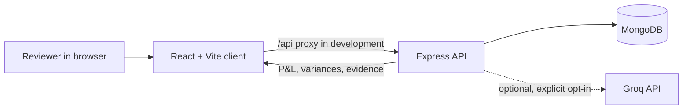

# Finz — NYC Restaurant Financial Review

Finz is a standalone financial-review web app for the **NYC Restaurant Co.** internship assignment. It turns bank transaction exports into a reviewable transaction ledger, a monthly P&L, month-to-month variance analysis, and evidence-backed answers to common financial questions.

The project is a prototype for a single restaurant workspace. Its assumptions are visible: the P&L is calculated from classified bank rows, uncertain items are flagged, and figures can be traced back to source transactions.

## Contents

- [What the app does](#what-the-app-does)
- [Technology and architecture](#technology-and-architecture)
- [Dataset](#dataset)
- [Accounting and classification rules](#accounting-and-classification-rules)
- [Run locally](#run-locally)
- [Environment variables](#environment-variables)
- [Pages and workflows](#pages-and-workflows)
- [API reference](#api-reference)
- [Testing and build](#testing-and-build)
- [Deployment](#deployment)
- [Security and limitations](#security-and-limitations)
- [Troubleshooting](#troubleshooting)

## What the app does

- Imports CSV, XLSX, and XLS bank transaction files through a preview-and-confirm flow.
- Validates required fields, reports invalid rows, and detects duplicates before saving.
- Assigns restaurant accounting categories with a confidence score, explanation, classification method, and review status.
- Stores transactions, import batches, review decisions, and manual category corrections in MongoDB.
- Calculates monthly revenue, COGS, gross profit, payroll, operating expenses, and operating profit from transaction records.
- Compares adjacent months and marks material changes using a documented threshold.
- Lets a reviewer search/filter the ledger, inspect a transaction, change its category, and resolve review items.
- Provides a bounded financial analyst that answers supported questions with source evidence.
- Supports optional Groq classification/explanations only when configured and explicitly enabled in the UI.

## Technology and architecture

| Area | Technology | Local address |
|---|---|---|
| Browser app | React 18, Vite, Axios | http://localhost:5173 (Vite may choose the next free port) |
| Styling | Tailwind CSS 3, PostCSS, custom CSS for dashboard charts and components | Built by Vite from client/src/index.css |
| API | Node.js 22, Express, Mongoose | http://localhost:5001 |
| Database | MongoDB local or MongoDB Atlas | Configured with FINZ_MONGODB_URI |
| Optional AI | Groq SDK, server-side only | Configured with GROQ_API_KEY |



The API computes financial totals and variance figures. Groq can optionally suggest classifications or rephrase facts already calculated by the API; it does not calculate P&L values or execute generated SQL.

### Folder layout

```text
finz-review-app/
├── client/
│   ├── src/App.jsx                 # Application pages and interactions
│   ├── src/index.css               # Tailwind layers and custom dashboard styles
│   ├── src/services/finzApi.js     # Browser-to-API requests
│   ├── .env.example                # Optional client API origin
│   ├── package.json
│   └── vite.config.js              # Dev server and /api proxy
├── server/
│   ├── data/NYC Restaurant Co - Raw Transactions.csv
│   ├── models/                    # Mongoose transaction and import-batch schemas
│   ├── routes/finz.js              # REST endpoints under /api/finz
│   ├── services/                  # Import, categories, P&L, corrections, analyst, AI
│   ├── scripts/seed.js             # Optional seed from bundled CSV
│   ├── tests/                      # Jest and Supertest tests
│   ├── package.json
│   └── server.js
├── package.json                    # Root convenience scripts
├── render.yaml                     # Render Blueprint for API and static client
└── README.md
```

MongoDB collections are named finz_transactions and finz_import_batches. This keeps Finz data separate from collections belonging to other applications in the same database.

## Dataset

The app uses the [NYC Restaurant Co. — Raw Transactions spreadsheet](https://docs.google.com/spreadsheets/d/1LuN7YOQtQRmaYGToQHcTtifV0U72tdYE/edit). A copy of the supplied data is bundled at server/data/NYC Restaurant Co - Raw Transactions.csv.

The file contains **181 data rows** across six fields: Transaction ID, Date, Description, Counterparty, Amount, and Method. The dates span **January 1 through March 31, 2026**; the source has seven observed payment-method labels. These counts describe the supplied file, not constants in the application.

The app does not hard-code the transaction rows or P&L totals. It parses and classifies the CSV, then calculates the P&L from the resulting transaction records. With the bundled file and current automatic rules, the initial calculated output is:

| P&L line | January 2026 | February 2026 | March 2026 |
|---|---:|---:|---:|
| Revenue | $126,399.09 | $125,617.29 | $150,535.07 |
| Cost of goods sold | $45,715.56 | $48,779.35 | $54,176.44 |
| Gross profit | $80,683.53 | $76,837.94 | $96,358.63 |
| Payroll | $41,757.07 | $44,870.99 | $50,729.81 |
| Operating expenses | $24,455.93 | $25,958.99 | $26,776.68 |
| Operating profit | $14,470.53 | $6,007.96 | $18,852.14 |

These are rule-based, bank-data estimates. A reviewer correction changes the categories and subsequent P&L/variance results, so values can differ after review.

## Accounting and classification rules

### P&L formula

- **Revenue** = classified sales, catering, and delivery receipts minus refunds and discounts.
- **COGS** = food and ingredients + beverage inventory + packaging/disposables.
- **Gross profit** = revenue − COGS.
- **Payroll** = wages + payroll taxes and benefits.
- **Operating expenses** = classified operating costs such as rent, utilities, insurance, marketing, software, repairs, professional services, office/admin, cleaning/linen, and delivery/payment fees.
- **Operating profit** = gross profit − payroll − operating expenses.

Expense lines are displayed as positive costs even though bank outflows are negative. Currency totals are rounded to cents. Refunds and discounts reduce revenue.

### Categories

The chart of accounts includes:

- **Revenue:** Food Sales, Beverage Sales, Catering Revenue, Delivery Revenue, Other Revenue.
- **Contra-revenue:** Sales Returns & Discounts.
- **COGS:** Food & Ingredients, Beverage Inventory, Packaging & Disposables.
- **Payroll:** Payroll Wages, Payroll Taxes & Benefits.
- **Operating expenses:** Rent, Utilities, Insurance, Marketing, Software & Subscriptions, Repairs & Maintenance, Delivery & Payment Fees, Professional Services, Office & Admin, Cleaning & Linen, Other Operating Expense.
- **Review / non-P&L:** Gift Card Liability, Sales Tax Payable, Equipment / Capital Purchase, Loan Principal, Owner Distribution, Needs Review.

Gift-card receipts, sales-tax remittances, loan principal, owner distributions, and equipment purchases are not included in operating profit. The transaction descriptions alone do not establish whether these are liabilities, equity movements, or capital assets, so they are routed to review. Interest and depreciation are not inferred.

Description rules handle recognizable transaction text. Unmatched rows go to **Needs Review** with lower confidence and are excluded from P&L until reviewed. Ambiguous liability/capital categories remain flagged even when a text rule recognizes them. Manual corrections save the original category, reviewer reason, and correction history.

### Variances

Adjacent months present in the database are compared. A change is called **material** when its absolute amount is at least **$500** and its relative change is at least **10%**. Relative change is calculated against the absolute value of the prior month. If the prior value is zero, the percentage is undefined; an absolute movement of at least $500 qualifies. Category drivers use category totals from the same transaction records. Expense changes have their sign reversed in profitImpact so increases in costs reduce profit.

### Classification confidence

Each row stores a confidence value from 0 to 1; the UI shows it as a percentage. The transaction explorer can filter low (<78%), medium (78–89%), and high (90%+) confidence. Confidence is a rule/model signal for reviewer attention, not a probability that accounting treatment is correct.

## Run locally

### Requirements

- Node.js **22.x** and npm.
- A running MongoDB service, or an Atlas cluster and its connection string.
- A modern browser.
- A Groq API key only if you want the optional hosted AI features.

### 1. Install dependencies

From the repository root:

```powershell
npm run install:all
```

This installs server and client packages separately. If you only want to install one side, run npm install inside server or client. Install packages in each folder before its npm start or npm run dev command; otherwise Node can report missing packages such as dotenv or vite.

### 2. Configure the API

From the repository root, create or open the local environment file:

```powershell
if (-not (Test-Path server/.env)) { New-Item -ItemType File server/.env | Out-Null }
notepad server/.env
```

Add these settings. The URI below uses local MongoDB; replace it with the Atlas URI shown below if you use Atlas:

```env
FINZ_MONGODB_URI=mongodb://127.0.0.1:27017/finz_review
PORT=5001
CLIENT_URL=http://localhost:5173
FINZ_SEED_FILE=
```

Leave FINZ_SEED_FILE blank to use the bundled assignment CSV. The seed script finds it automatically.

For MongoDB Atlas, use the SRV URI copied from **Atlas → Connect → Drivers** and include finz_review as the database name, for example:

```env
FINZ_MONGODB_URI=mongodb+srv://<database-user>:<url-encoded-password>@<cluster-host>/finz_review?retryWrites=true&w=majority&appName=<app-name>
```

Before connecting, create an Atlas **database user** and add the machine/server IP to the project's **Network Access** list. The Atlas website account and database user are separate. URL-encode reserved characters in the password (for example, @ becomes %40). Do not use a broadly open IP rule for a deployed database. See the [Atlas connection guide](https://www.mongodb.com/docs/atlas/connect-to-database-deployment/) for current steps.

server/.env is ignored by Git. Do not commit it, paste its connection string into source files, or put database secrets in the browser/client. The repository tracks client/.env.example for the optional browser API URL, but intentionally does not track a server environment template. If a credential was shared or committed, rotate it with the relevant provider.

### 3. Load the sample transactions (optional)

If the database is empty and you want to start with the assignment data, run from the repository root:

```powershell
npm run seed --prefix server
```

The seed script imports the bundled CSV only when the Finz transaction collection is empty. Alternatively, skip seeding and use **Import transactions** in the UI. The import preview validates rows and detects duplicates before confirmation.

### 4. Start the API

Open a terminal at the repository root and run:

```powershell
npm run dev:api
```

For a non-watch start from the server directory, use:

```powershell
cd server
npm start
```

The API connects to MongoDB before it begins listening. Check http://localhost:5001/api/finz/health; a successful response reports "ok": true and "database": "connected".

### 5. Start the client

In a second terminal:

```powershell
npm run dev:web
```

Or run the command the client folder exposes directly:

```powershell
cd client
npm run dev
```

Open the exact **Local** URL printed by Vite, normally http://localhost:5173. If that port is already occupied, Vite may choose 5174 or another port. Keep the client and API terminals running while using the app. The Vite development server proxies /api to http://localhost:5001.

### Convenience scripts

| From repository root | Purpose |
|---|---|
| npm run install:all | Install server and client dependencies |
| npm run dev:api | Start the API in watch mode |
| npm run dev:web | Start the Vite client |
| npm start | Start the API |
| npm run seed --prefix server | Seed the bundled CSV if the collection is empty |
| npm run build | Build the client for production |
| npm test | Run the server Jest suite |

## Environment variables

| Variable | Used by | Required | Meaning |
|---|---|---:|---|
| FINZ_MONGODB_URI | Server | Atlas only | Set this for Atlas; otherwise the API falls back to local finz_review. |
| PORT | Server | No | API port; defaults to 5001 (Render provides its own port). |
| CLIENT_URL | Server | No | Allowed browser origin(s), comma-separated; local example is http://localhost:5173. |
| GROQ_API_KEY | Server | No | Enables optional Groq categorization/explanations. Keep it server-side. |
| GROQ_MODEL | Server | No | Optional Groq model name; defaults to llama-3.3-70b-versatile. |
| FINZ_SEED_FILE | Server | No | CSV path override for the seed script. |
| FINZ_AUTO_SEED | Server | No | Set to true to seed the bundled file at API startup if the collection is empty. |
| VITE_API_URL | Client | No | API origin for deployment; blank uses Vite proxy in development or same-origin requests. |

## Pages and workflows

- **Overview:** selected-month KPIs, performance chart, review count, recent transactions, and material variance highlights.
- **Profit & Loss:** month-by-month statement; clicking an account amount opens source transactions for that line.
- **Variances:** adjacent-period comparisons, materiality labels, category movements, and evidence rows for selected periods.
- **Transactions:** ledger search, category/confidence/review filters, sort controls, paging, and transaction details.
- **Needs Review:** unresolved transactions requiring category/accounting confirmation.
- **Import:** CSV/XLS/XLSX upload, preview counts, validation errors, duplicate detection, optional AI classification consent, and confirmation.
- **AI Analyst:** supported questions about revenue, monthly payroll, COGS/profit changes, transactions, and review items; answers include transaction evidence.

Category corrections and review decisions are sent to the API and persisted in MongoDB. Corrected classifications are reflected in later P&L and variance calculations.

## API reference

All routes are prefixed with /api/finz.

| Method | Endpoint | Purpose |
|---|---|---|
| GET | /health | API and MongoDB connection state |
| GET | /overview | Ledger rows, monthly P&L, variances, counts, latest imported batch |
| GET | /categories | Chart of accounts and P&L mapping |
| GET | /transactions | Search/filter/sort/paginate by query, month, category, review, confidence |
| GET | /transactions/:id | One transaction and classification history |
| PATCH | /transactions/:id | Correct category or change review state |
| POST | /imports/preview | Validate and preview a CSV/XLSX/XLS upload |
| POST | /imports/:id/confirm | Save a previewed batch with database duplicate checks |
| GET | /imports | Recent completed import batches |
| GET | /financial/pnl?month=YYYY-MM | P&L for available transaction months |
| GET | /financial/variances | Adjacent-month metrics, drivers, and thresholds |
| GET | /reviews | Unresolved review queue |
| POST | /analyst | Run a bounded analyst query and return evidence |

The analyst request body is { "question": "...", "useExternalAI": false }. Questions are limited to 500 characters. The analyst does not accept SQL or arbitrary database instructions.

## Testing and build

From the repository root:

```powershell
npm test
npm run build
```

The Jest/Supertest tests cover CSV and XLSX parsing, invalid rows, classification rules, manual corrections, review selection, P&L calculations, evidence IDs, materiality, category drivers, and API health/catalog/request validation. Database-backed import and correction flows require a running MongoDB database for end-to-end verification.

Development smoke checks have also exercised the bundled CSV parser, January–March calculations, analyst evidence, API health/category/request validation, and Vite/Tailwind CSS transformation. Run the full commands above after installing the dependencies in your own environment.

## Deployment

render.yaml defines two Render services: an Express API from server and a static Vite site from client. For a GitHub repository whose root is this folder:

1. Create or select a MongoDB Atlas database and add the API service's outbound IP/network access as appropriate for your hosting plan.
2. In Render, create services from the Blueprint or configure the API and client separately.
3. Set API environment variables: FINZ_MONGODB_URI, CLIENT_URL (the deployed client origin), and optional GROQ_API_KEY/GROQ_MODEL.
4. Set the client's VITE_API_URL to the deployed API origin before its static build.
5. Import the CSV through the web app or run the seed process using a one-off command with the same server environment.

Do not commit .env files. Configure secrets through the hosting provider's environment-variable settings. render.yaml requests secret values rather than embedding them in source. Deployment has not been performed from this repository.

## Security and limitations

- This is a **single-workspace prototype**. Authentication, authorization, and per-user tenant isolation are not implemented; do not expose it as a multi-user production finance system without adding them.
- The API uses Helmet, a 32 KB JSON limit, CORS configuration, a 10 MB in-memory upload limit, supported file extensions, and an in-memory request limit of 180 requests per IP per minute. A production service should also use durable rate limiting, stronger file inspection, logging/monitoring, and deployment-specific network controls.
- Hosted AI is disabled unless the user opts in. Only unfamiliar transaction fields or bounded analyst context may be sent to Groq when the corresponding option is enabled and a server key is configured. Transaction descriptions are treated as untrusted text.
- This P&L is a bank-transaction approximation, not accrual accounting. It does not infer inventory consumption, split deposits, depreciation, interest, tax accruals, or other facts absent from the source records.
- The transaction explorer currently loads the small assignment ledger through the overview API and filters it client-side. A paginated server endpoint is also available for larger ledgers.
- The installed API dependency tree reports a high-severity npm advisory for Multer 1.x. Review and upgrade that dependency before deploying publicly; rerun npm audit after dependency changes.

## Troubleshooting

| Symptom | Fix |
|---|---|
| vite is not recognized | Run npm install inside client, then npm run dev. Or run npm run install:all from the repository root. |
| Cannot find module dotenv | Run npm install inside server (or install both projects from the root), then retry npm start. |
| Browser says connection refused | Keep the Vite terminal running and open the exact URL Vite prints. Start the API in another terminal for financial data. |
| UI says API needs attention | Check that MongoDB is running/reachable, then start the API. Test /api/finz/health. |
| MongoDB connection timeout | Verify the Atlas host/user/password, URI-encode reserved password characters, and add the API machine's IP to Atlas Network Access. |
| Import reports no required columns | Include date, description, and amount columns. Transaction ID, counterparty, and payment method are optional. |
| Atlas authentication fails | Use a MongoDB **database user**, not the Atlas website login. Rotate any credential shared in chat or committed by mistake. |
| Vite uses port 5174 instead of 5173 | Another process owns 5173; open the alternate Local URL printed by Vite. |

For additional details about Atlas connectivity, see the [official MongoDB Atlas connection documentation](https://www.mongodb.com/docs/atlas/connect-to-database-deployment/).
